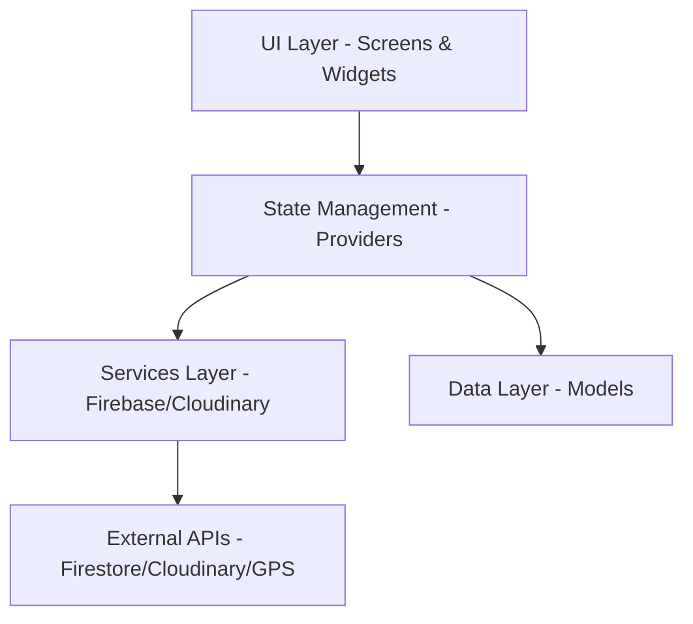
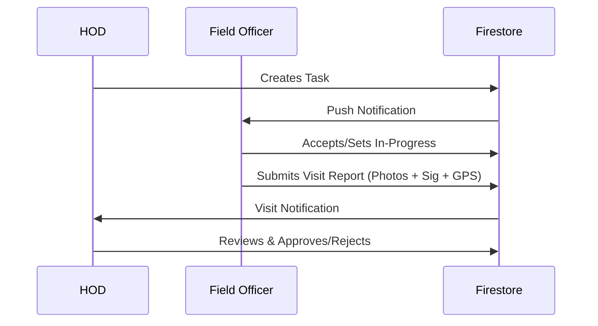

# INSPETTO: Project Documentary
## Tamil Nadu Government Field Visit Inspection Management System

**INSPETTO** is a comprehensive digital solution designed to streamline, monitor, and manage field visit inspections for various government departments in Tamil Nadu. The system ensures transparency, accountability, and real-time data collection from the field to the highest levels of administration.

---

## 1. Executive Summary

### Overview
INSPETTO replaces traditional paper-based inspection methods with a robust, location-aware mobile application. It enables high-ranking officials (HODs/Collectors) to assign tasks and track progress, while Field Officers can submit verified, data-rich reports directly from the inspection sites.

### Key Goals
- **Real-time Monitoring**: Instant visibility into field activities.
- **Verification**: GPS-tagged photos and digital signatures to prevent fraudulent reporting.
- **Efficiency**: Structured workflows for task creation, assignment, and approval.
- **Role-based Access**: Specific interfaces for Admin, Collector, HOD, and Field Officers.

---

## 2. Technical Stack & Architecture

### Core Technologies
- **Framework**: [Flutter](https://flutter.dev/) (3.6.0+)
- **State Management**: [Provider](https://pub.dev/packages/provider)
- **Database**: [Google Cloud Firestore](https://firebase.google.com/docs/firestore)
- **Authentication**: [Firebase Auth](https://firebase.google.com/docs/auth) (Phone/OTP)
- **Asset Storage**: [Cloudinary](https://cloudinary.com/) (Images & Signatures)
- **Maps**: [Flutter Map](https://pub.dev/packages/flutter_map) with OpenStreetMap.

### System Architecture
The application follows a modular, layered architecture for maintainability and scalability.

### File Structure Overview
- `lib/models/`: Defines data structures (User, Task, Visit, etc.).
- `lib/providers/`: Contains business logic and state (Auth, Task, Visit).
- `lib/services/`: Handles integrations (Cloudinary, Notifications, Firebase).
- `lib/screens/`: UI organized by role-specific folders.
- `lib/widgets/`: Shared UI components (Custom buttons, cards, etc.).

---

## 3. User Roles & Workflows

### Role-Based Access Control (RBAC)
The app identifies four distinct user roles, each with a unique dashboard and set of permissions.

#### 1. District Collector
- **Scope**: Entire District.
- **Key Functions**: Monitor statistics across all departments, view high-priority task statuses, and review critical visit reports.

#### 2. Head of Department (HOD)
- **Scope**: Specific Department (e.g., Highways, Agriculture).
- **Key Functions**: Create and assign tasks to Field Officers, review submitted visits, and manage their department's team.

#### 3. Field Officer
- **Scope**: Assigned Tasks.
- **Key Functions**: Conduct field visits, capture photos, record progress, and submit reports with digital signatures and GPS verification.

#### 4. IT Admin
- **Scope**: System-wide.
- **Key Functions**: Manage user accounts, departments, and system configurations.

### The Lifecycle of a Task

---

## 4. Key Functional Features

### 📸 Advanced Visit Reporting
Field Officers can submit rich reports including:
- **Primary Visit Photo**: Mandatory for identification.
- **Additional Photos**: For detailed evidence.
- **GPS Verification**: Automatically captures coordinates and location address.
- **Progress Tracking**: 0-100% completion status for ongoing projects.
- **Digital Signatures**: Captured on-device using a signature pad.

### 🗺 Interactive Mapping
- **Heatmaps/Pins**: Displaying visit locations for HODs and Collectors.
- **Navigation**: Field Officers can see task locations on a map to optimize their route.

### 🔒 Security & Verification
- **Biometric/PIN**: Local authentication (FaceID/Fingerprint) for sensitive actions.
- **Anti-Spoofing**: Image timestamps and GPS metadata are cross-referenced to ensure authenticity.
- **Background Uploads**: Uses a non-blocking queue (via Cloudinary) to ensure the UI remains responsive even during slow uploads.

---

## 5. Data Models (Firestore Schema)

### Employees Collection (`/employees`)
| Field | Type | Description |
| :--- | :--- | :--- |
| `employeeId` | String (ID) | Unique system identifier. |
| `role` | String | `it_admin`, `hod`, `field_officer`, `collector`. |
| `district` | String | Working district. |
| `department` | String | Assigned government department. |

### Tasks Collection (`/tasks`)
| Field | Type | Description |
| :--- | :--- | :--- |
| `title` | String | Brief description of the work. |
| `assignedTo` | String | Employee ID of the Field Officer. |
| `status` | String | `assigned`, `accepted`, `inprogress`, `completed`. |
| `deadline` | Timestamp | Expected completion date. |

---

## 6. Setup & Configuration

### Prerequisites
- Flutter SDK 3.6.0+
- Firebase Project with Firestore and Auth enabled.
- Cloudinary Account (Standard/Free tier).

### Environment Setup
1. **Firebase**: Add `google-services.json` (Android) and `GoogleService-Info.plist` (iOS).
2. **Cloudinary**: Update credentials in `lib/services/cloudinary_service.dart`.
3. **Dependencies**: Run `flutter pub get`.

---

> [!NOTE]
> This documentation is a living document and should be updated whenever new integrations (e.g., PDF Export, Advanced Analytics) are added to the system.

> [!TIP]
> For production deployment, ensure that Cloudinary API secrets are moved to environment variables or a secure vault instead of being hardcoded in the service file.
